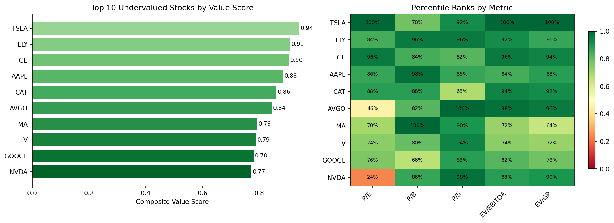

# Value Investing Algorithm

A quantitative value investing screener that ranks S&P 500 securities using five fundamental analysis ratios, identifying the top 10 most undervalued stocks.

## Overview

This algorithm implements a multi-factor value scoring system using five key valuation ratios. Each security is percentile-ranked across all metrics to produce a composite value score, surfacing the most attractively valued opportunities in the S&P 500.

## Methodology

Securities are evaluated and percentile-ranked using:

| Ratio | What it measures |
|-------|------------------|
| **P/E** | Share price relative to earnings per share |
| **P/B** | Market price relative to book value |
| **P/S** | Market valuation relative to total sales |
| **EV/EBITDA** | Enterprise value relative to core operating profitability |
| **EV/GP** | Enterprise value relative to gross profit |

## Tools & Libraries

- **Python** (pandas, NumPy, yfinance, SciPy, matplotlib)
- Fundamental data via Yahoo Finance API
- Statistical percentile ranking and composite scoring

## Key Outputs

- Composite value scores across all five metrics
- Percentile heatmap showing per-metric rankings
- Recommended position sizes for a $500,000 portfolio

## Sample Output

## Project Type

Personal Project

## Usage

Open [`value_investing.ipynb`](value_investing.ipynb) for the full implementation and walkthrough.
